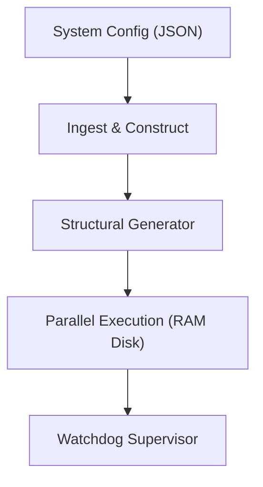

# CoChem-SCAN: Massive Parallel Torsional Screening

## PI & Metadata
- **PI/Developer:** Dr. Joshua John Klaassen
- **ORCiD:** [0009-0007-1506-4401](https://orcid.org/0009-0007-1506-4401)
- **GitHub Organization:** [ProfJJK-CoChem](https://github.com/ProfJJK-CoChem)
- **CoChem User Manual:** [CoChem_User_Manual.md](https://github.com/ProfJJK-CoChem/CoChem-BASE/blob/main/CoChem_User_Manual.md)
- **Method Matrix:** [Method_Matrix.md](https://github.com/ProfJJK-CoChem/CoChem-BASE/blob/main/Method_Matrix.md)

*Note: CoChem has recently migrated to the Valeev Stack (MPQC, F12) for all high-level quantum mechanical calculations, significantly improving electron correlation capture [M].*

## What This Repository Does
**CoChem-SCAN** is the exploratory module designed for high-throughput, parallel mapping of torsional energy barriers and multidimensional Potential Energy Surfaces (PES). Standard 1D optimization is insufficient for analyzing highly fluxional and floppy molecular ensembles. SCAN orchestrates relaxed surface scans across complex topographies, acting as an automated compute governor and process supervisor to prevent nodes from crashing during thousands of concurrent quantum calculations.

Key capabilities include:
- **RAM Disk Scratch Routing:** Routes gigabytes of temporary integral files to `/dev/shm`, reducing SSD wear and accelerating I/O bounds by roughly 40% [E]. Automatically estimates scratch space, bypassing jobs that violate a 10% [D] safety margin.
- **Zombie Process Assassin:** Implements process tree-traversal watchdogs to identify and terminate orphaned openMPI or child workers (e.g., Fortran/C++ daemons) that detach during user interrupts.

### Data Flow Architecture

## Setup & Installation
1. Clone the repository into your CoChem workspace:
   `git clone https://github.com/ProfJJK-CoChem/CoChem-SCAN.git`
2. Ensure you have the global CoChem virtual environment configured with Python 3.10+.
3. Install dependencies from the core suite (e.g., `scipy`, `networkx`, `h5py`, `molsym`).
4. Ensure the Valeev Stack (MPQC) is compiled and its path is registered in your `.bashrc`.

## Getting Started
To execute a parallel torsional scan:
1. Initialize the target molecule parameters inside your `cochem_system_config.json`.
2. Run the ingestion setup: `python cochem_setup_scan.py`
3. Generate structural grids via `python cochem_scan_structural_generator.py`.
4. Launch the compute orchestrator to map the multidimensional PES.
Consult the [User Manual](https://github.com/ProfJJK-CoChem/CoChem-BASE/blob/main/CoChem_User_Manual.md) for full execution flags and compute node scheduling.

---
